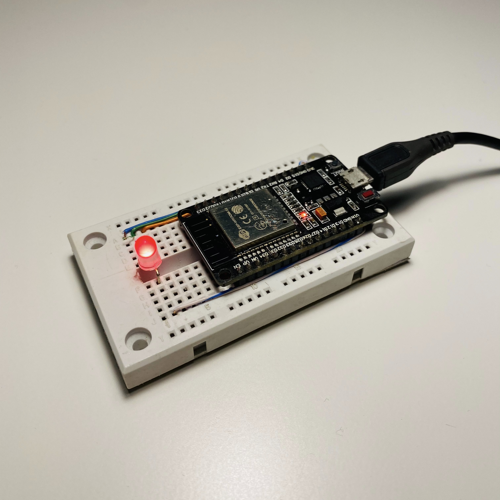

# ESP_IDF_SmartLED

>This code is responsible for configure ESP32 SoC, configure GPIO's and establish Bluetooth connection with iPhone using [ESP-IDF] which is official development framework for ESP32
  
# Hadrware


* [ESP32] - used SoC
* [RGB LED] - example of RGB LED
* Some current limitting resistors for each LED channel

 
##This device is controlled by my iOS application that is available in this repository: 
[SwiftUI_SmartLED iOS Application]


# LED Configuration
The LED is controlled by official provided LEDC (LED Control) phrepiperal that is designed to control the intensity of LEDs.
Official documentatiton: [LEDC documentatiton]
## LED GPIO's & PWM Configuration 
```c
void user_led_pwm_init(void)
{
    ledc_timer_config_t ledc_timer = {
        .duty_resolution = LEDC_TIMER_8_BIT, // resolution of PWM duty
        .freq_hz = 5000,                      // frequency of PWM signal
        .speed_mode = LEDC_HS_MODE,           // timer mode
        .timer_num = LEDC_HS_TIMER,           // timer index
        .clk_cfg = LEDC_AUTO_CLK,             // Auto select the source clock
    };
    ledc_timer_config(&ledc_timer);

    ledc_channel_config_t ledc_channel_R = {.channel = LEDC_R_CHANNEL,
                                            .duty = 256,
                                            .gpio_num = LEDC_R_GPIO,
                                            .speed_mode = LEDC_HS_MODE,
                                            .hpoint = 0,
                                            .timer_sel = LEDC_HS_TIMER};
    ledc_channel_config(&ledc_channel_R);

    ledc_channel_config_t ledc_channel_G = {.channel = LEDC_G_CHANNEL,
                                            .duty = 256,
                                            .gpio_num = LEDC_G_GPIO,
                                            .speed_mode = LEDC_HS_MODE,
                                            .hpoint = 0,
                                            .timer_sel = LEDC_HS_TIMER};
    ledc_channel_config(&ledc_channel_G);

    ledc_channel_config_t ledc_channel_B = {.channel = LEDC_B_CHANNEL,
                                            .duty = 256,
                                            .gpio_num = LEDC_B_GPIO,
                                            .speed_mode = LEDC_HS_MODE,
                                            .hpoint = 0,
                                            .timer_sel = LEDC_HS_TIMER};
    ledc_channel_config(&ledc_channel_B);
}
```
 
# Bluetooth Configuration
Bluetooth configuration is prepared with help of offical walkthrough: [Bluetooth Example Walkthrough]

## Creating Bluetooth Services
I have two options to choose from (for eductional reasons)
1.Control every LED color as separate Bluetooth serivce.
2.Control RGB colors as one service and send array of RBG data. - I have choosed this one.
```c
enum
{
    LED_SERVICE,
    LED_RED_CHARACTERISTIC,
    LED_RED_CHARACTERISTIC_VALUE,
    LED_RED_CHARACTERISTIC_CONFIGURATION,

    LED_GREEN_CHARACTERISTIC,
    LED_GREEN_CHARACTERISTIC_VALUE,
    LED_GREEN_CHARACTERISTIC_CONFIGURATION,

    LED_BLUE_CHARACTERISTIC,
    LED_BLUE_CHARACTERISTIC_VALUE,
    LED_BLUE_CHARACTERISTIC_CONFIGURATION,

    LED_RGB_CHARACTERISTIC,
    LED_RGB_CHARACTERISTIC_VALUE,
    LED_RGB_CHARACTERISTIC_CONFIGURATION,

    LED_INDEX_NUMBER,
};
```


## Services configuration 
```c
static const esp_gatts_attr_db_t gatt_db[LED_INDEX_NUMBER] =
{
    // Service Declaration
    [LED_SERVICE]        =
    {{ESP_GATT_AUTO_RSP}, {ESP_UUID_LEN_16, (uint8_t *)&primary_service_uuid, ESP_GATT_PERM_READ,
      sizeof(uint16_t), sizeof(LED_SERVICE_UUID), (uint8_t *)&LED_SERVICE_UUID}},

    /* Characteristic Declaration */
    [LED_RED_CHARACTERISTIC]     =
    {{ESP_GATT_AUTO_RSP}, {ESP_UUID_LEN_16, (uint8_t *)&character_declaration_uuid, ESP_GATT_PERM_READ,
      CHAR_DECLARATION_SIZE, CHAR_DECLARATION_SIZE, (uint8_t *)&char_prop_read_write_notify}},

    /* Characteristic Value */
    [LED_RED_CHARACTERISTIC_VALUE] =
    {{ESP_GATT_AUTO_RSP}, {ESP_UUID_LEN_16, (uint8_t *)&LED_RED_CHARACTERISTIC_UUID, ESP_GATT_PERM_READ | ESP_GATT_PERM_WRITE,
      GATTS_DEMO_CHAR_VAL_LEN_MAX, sizeof(led_red), (uint8_t *)led_red}},

    /* Client Characteristic Configuration Descriptor */
    [LED_RED_CHARACTERISTIC_CONFIGURATION]  =
    {{ESP_GATT_AUTO_RSP}, {ESP_UUID_LEN_16, (uint8_t *)&character_client_config_uuid, ESP_GATT_PERM_READ | ESP_GATT_PERM_WRITE,
      sizeof(uint8_t), sizeof(led_red), (uint8_t *)led_red}},

      /* Characteristic Declaration */
    [LED_GREEN_CHARACTERISTIC]     =
    {{ESP_GATT_AUTO_RSP}, {ESP_UUID_LEN_16, (uint8_t *)&character_declaration_uuid, ESP_GATT_PERM_READ,
      CHAR_DECLARATION_SIZE, CHAR_DECLARATION_SIZE, (uint8_t *)&char_prop_read_write_notify}},

    /* Characteristic Value */
    [LED_GREEN_CHARACTERISTIC_VALUE] =
    {{ESP_GATT_AUTO_RSP}, {ESP_UUID_LEN_16, (uint8_t *)&LED_GREEN_CHARACTERISTIC_UUID, ESP_GATT_PERM_READ | ESP_GATT_PERM_WRITE,
      GATTS_DEMO_CHAR_VAL_LEN_MAX, sizeof(led_green), (uint8_t *)led_green}},

    /* Client Characteristic Configuration Descriptor */
    [LED_GREEN_CHARACTERISTIC_CONFIGURATION]  =
    {{ESP_GATT_AUTO_RSP}, {ESP_UUID_LEN_16, (uint8_t *)&character_client_config_uuid, ESP_GATT_PERM_READ | ESP_GATT_PERM_WRITE,
      sizeof(uint8_t), sizeof(led_green), (uint8_t *)led_green}},

      /* Characteristic Declaration */
    [LED_BLUE_CHARACTERISTIC]     =
    {{ESP_GATT_AUTO_RSP}, {ESP_UUID_LEN_16, (uint8_t *)&character_declaration_uuid, ESP_GATT_PERM_READ,
      CHAR_DECLARATION_SIZE, CHAR_DECLARATION_SIZE, (uint8_t *)&char_prop_read_write_notify}},

    /* Characteristic Value */
    [LED_BLUE_CHARACTERISTIC_VALUE] =
    {{ESP_GATT_AUTO_RSP}, {ESP_UUID_LEN_16, (uint8_t *)&LED_BLUE_CHARACTERISTIC_UUID, ESP_GATT_PERM_READ | ESP_GATT_PERM_WRITE,
      GATTS_DEMO_CHAR_VAL_LEN_MAX, sizeof(led_blue), (uint8_t *)led_blue}},

    /* Client Characteristic Configuration Descriptor */
    [LED_BLUE_CHARACTERISTIC_CONFIGURATION]  =
    {{ESP_GATT_AUTO_RSP}, {ESP_UUID_LEN_16, (uint8_t *)&character_client_config_uuid, ESP_GATT_PERM_READ | ESP_GATT_PERM_WRITE,
      sizeof(uint8_t), sizeof(led_blue), (uint8_t *)led_blue}},

      [LED_RGB_CHARACTERISTIC]     =
    {{ESP_GATT_AUTO_RSP}, {ESP_UUID_LEN_16, (uint8_t *)&character_declaration_uuid, ESP_GATT_PERM_READ,
      CHAR_DECLARATION_SIZE, CHAR_DECLARATION_SIZE, (uint8_t *)&char_prop_read_write_notify}},

    /* Characteristic Value */
    [LED_RGB_CHARACTERISTIC_VALUE] =
    {{ESP_GATT_AUTO_RSP}, {ESP_UUID_LEN_16, (uint8_t *)&LED_RGB_CHARACTERISTIC_UUID, ESP_GATT_PERM_READ | ESP_GATT_PERM_WRITE,
      GATTS_DEMO_CHAR_VAL_LEN_MAX, sizeof(led_RGB), (uint8_t *)led_RGB}},

    /* Client Characteristic Configuration Descriptor */
    [LED_RGB_CHARACTERISTIC_CONFIGURATION]  =
    {{ESP_GATT_AUTO_RSP}, {ESP_UUID_LEN_16, (uint8_t *)&character_client_config_uuid, ESP_GATT_PERM_READ | ESP_GATT_PERM_WRITE,
      sizeof(uint32_t), sizeof(led_RGB), (uint8_t *)led_RGB}},
};
```

## Managing of delivered Bluetooth data
When data are delivered  the server callback ``` ESP_GATTS_WRITE_EVT ``` is called
Data are delivered as  parameter: ``` gatts_write_evt_param  ``` which include: 

 ``` 
 uint16_t conn_id;         /*!< Connection id */
uint32_t trans_id;        /*!< Transfer id */
esp_bd_addr_t bda;        /*!< The bluetooth device address which been written */
uint16_t handle;          /*!< The attribute handle */
uint16_t offset;          /*!< Offset of the value, if the value is too long */
bool need_rsp;            /*!< The write operation need to do response */
bool is_prep;             /*!< This write operation is prepare write */
uint16_t len;             /*!< The write attribute value length */
uint8_t *value;           /*!< The write attribute value */
 ``` 


RBG data delivered from my iPhone are inside of ```  uint8_t *value; ``` 
In next step Im going to read that data and set each PWM channel to finally control LED
```c
case ESP_GATTS_WRITE_EVT:
            if (!param->write.is_prep){            
                ESP_LOGI(GATTS_TABLE_TAG, "GATT_WRITE_EVT, handle = %d, value len = %d, value :", param->write.handle, param->write.len);
                esp_log_buffer_hex(GATTS_TABLE_TAG, param->write.value, param->write.len);

                     if (param->write.handle == led_value_handle_table[LED_RGB_CHARACTERISTIC_VALUE]) {
                        led_blue_value = *param->write.value;
                        ledc_set_duty(LEDC_HS_MODE, LEDC_R_CHANNEL, (255 - param->write.value[0] + 1));
                        ledc_update_duty(LEDC_HS_MODE, LEDC_R_CHANNEL);

                        ledc_set_duty(LEDC_HS_MODE, LEDC_G_CHANNEL, (255 - param->write.value[1] + 1));
                        ledc_update_duty(LEDC_HS_MODE, LEDC_G_CHANNEL);

                        ledc_set_duty(LEDC_HS_MODE, LEDC_B_CHANNEL, (255 - param->write.value[2] + 1));
                        ledc_update_duty(LEDC_HS_MODE, LEDC_B_CHANNEL);
                    }

                /* send response when param->write.need_rsp is true*/
                if (param->write.need_rsp){
                    esp_ble_gatts_send_response(gatts_if, param->write.conn_id, param->write.trans_id, ESP_GATT_OK, NULL);
                }
            }else{
                /* handle prepare write */
                example_prepare_write_event_env(gatts_if, &prepare_write_env, param);
            }

      	    break;
```


[ESP32]: <https://www.espressif.com/en/products/socs/esp32>
[ESP-IDF]: <https://docs.espressif.com/projects/esp-idf/en/latest/esp32/>
[LEDC documentatiton]: <https://docs.espressif.com/projects/esp-idf/en/latest/esp32/api-reference/peripherals/ledc.html>
[Bluetooth Example Walkthrough]: <https://github.com/espressif/esp-idf/blob/1067b28707e527f177752741e3aa08b5dc64a4d7/examples/bluetooth/bluedroid/ble/gatt_server_service_table/tutorial/Gatt_Server_Service_Table_Example_Walkthrough.md>
[RGB LED]: <https://www.sparkfun.com/products/10820>
[SwiftUI_SmartLED iOS Application]: <https://github.com/konifer44/SwiftUI_SmartLED>
